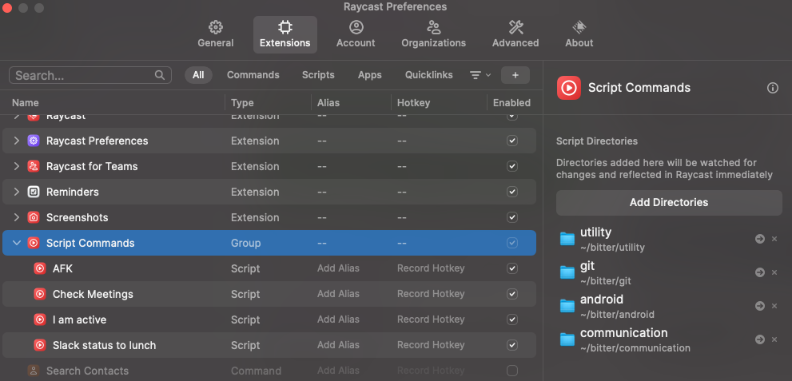
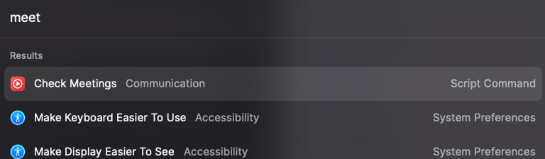

# Bitter productivity

## Installation

Simply make a clone of the repository
```shell 
   git clone git@github.com:RishabJaiswal/bitter.git
```

### Using in your terminal

1. Add `PATH` to `bitter` tools in your bash config file; `.zshrc` | `.bashrc`, etc.
```Text
In your .zshrc file add the following lines

#adding custom scripts
export PATH="<PATH-TO-REPOSITORY>/git:$PATH"
export PATH="<PATH-TO-REPOSITORY>/utility:$PATH"
export PATH="<PATH-TO-REPOSITORY>/communication:$PATH"
export PATH="<PATH-TO-REPOSITORY>/android:$PATH"
```
2. Start a new terminal instance or reload your terminal by running `source ~/.zshrc`
3. Now, the Bitter tools are loaded in your terminal instance.

### Using with your Raycast

Some Bitter tools are compatible with Raycast. To add Bitter tools in your Raycast,
follow these steps

1. Open Raycast Preferences.
2. Add the subdirectories in the `bitter` repository as `Script Commands` as shown in image

3. `Bitter` tools are now available in your Raycast

   

## Personalisation

Some `bitter` tools require personal information to execute.
For eg; setting `Slack status as away` require a personal access token.

To personalise `bitter`, it is recommended to check out a branch from `main` & 
add your needed personal information.
You can rebase your personalised branch on an updated `main` to fetch the latest features.

### Getting a Slack personal access token
Note: DO NOT publish your tokens to any public platform like `Github`, etc.

To use Slack tools, check how to get [Slack personal access token].

[Slack personal access token]: ./docs/slack_access_token.md

